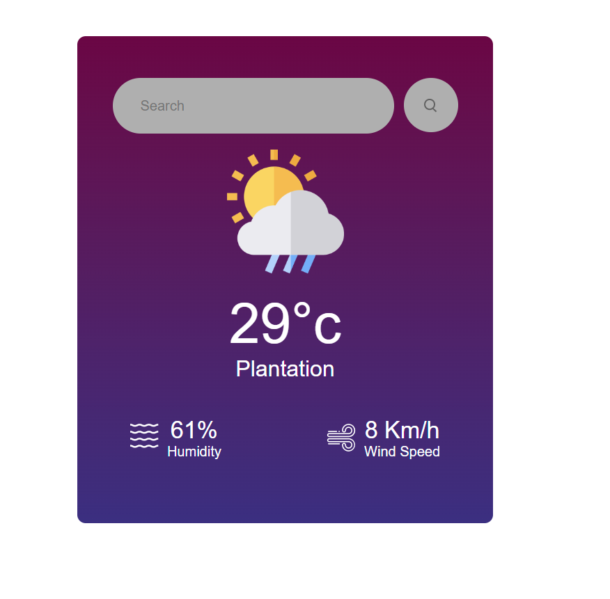

# Frontend Mentor - E-commerce product page

# Weather App

This is a simple weather application built using React. It allows users to search for the weather of a specific city and displays the current temperature, location, humidity, and wind speed. Additionally, it dynamically changes the weather icon based on the current weather condition.

## Features

- Search for the weather of any city
- Display current temperature in Celsius
- Display location
- Display humidity percentage
- Display wind speed in kilometers per hour
- Dynamically change weather icon based on weather condition

## Technologies Used

- React
- useState hook for managing state
- OpenWeatherMap API for fetching weather data
- CSS for styling

# Frontend Mentor - E-commerce product page

# Weather App

This is a simple weather application built using React. It allows users to search for the weather of a specific city and displays the current temperature, location, humidity, and wind speed. Additionally, it dynamically changes the weather icon based on the current weather condition.

## Features

- Search for the weather of any city
- Display current temperature in Celsius
- Display location
- Display humidity percentage
- Display wind speed in kilometers per hour
- Dynamically change weather icon based on weather condition

## Technologies Used

- React
- useState hook for managing state
- OpenWeatherMap API for fetching weather data
- CSS for styling

